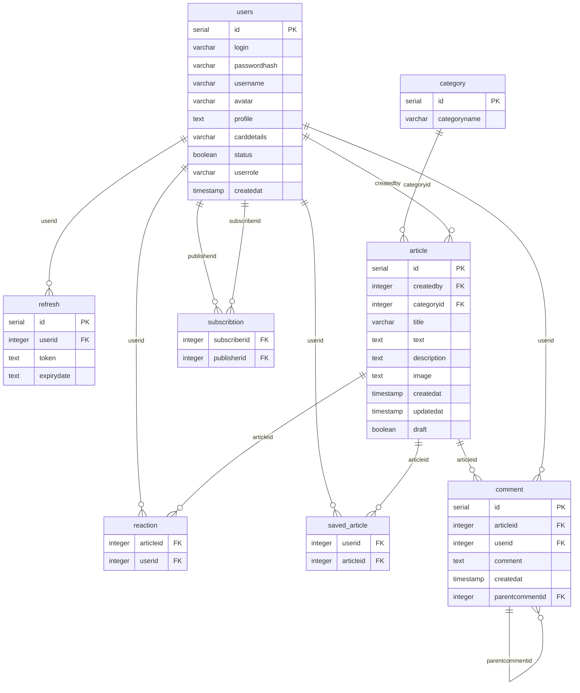

# База данных EduFlow — документация

СУБД: **PostgreSQL 16**  
Миграции: **Liquibase** (`EduFlowAPI-service/src/main/resources/db/changelog/liquidbase-changeLog.xml`)

---

## Таблицы

### `category`

Категории статей.

| Столбец        | Тип           | Ограничения              |
|----------------|---------------|--------------------------|
| `id`           | SERIAL        | PRIMARY KEY              |
| `categoryname` | VARCHAR(225)  | NOT NULL                 |

---

### `users`

Пользователи платформы.

| Столбец        | Тип                            | Ограничения              |
|----------------|--------------------------------|--------------------------|
| `id`           | SERIAL                         | PRIMARY KEY              |
| `login`        | VARCHAR(225)                   | NOT NULL, UNIQUE         |
| `passwordhash` | VARCHAR(225)                   | NOT NULL, UNIQUE         |
| `username`     | VARCHAR(225)                   | NOT NULL                 |
| `avatar`       | VARCHAR(225)                   | —                        |
| `profile`      | TEXT                           | —                        |
| `carddetails`  | VARCHAR(225)                   | —                        |
| `status`       | BOOLEAN                        | NOT NULL                 |
| `userrole`     | VARCHAR(50)                    | NOT NULL                 |
| `createdat`    | TIMESTAMP(0) WITHOUT TIME ZONE | DEFAULT NOW()            |

---

### `refresh`

Refresh-токены для обновления JWT-сессий.

| Столбец      | Тип     | Ограничения                              |
|--------------|---------|------------------------------------------|
| `id`         | SERIAL  | PRIMARY KEY                              |
| `userid`     | INTEGER | FOREIGN KEY → `users(id)`               |
| `token`      | TEXT    | —                                        |
| `expirydate` | TEXT    | —                                        |

---

### `article`

Статьи пользователей.

| Столбец       | Тип                            | Ограничения                              |
|---------------|--------------------------------|------------------------------------------|
| `id`          | SERIAL                         | PRIMARY KEY                              |
| `createdby`   | INTEGER                        | NOT NULL, FOREIGN KEY → `users(id)`      |
| `categoryid`  | INTEGER                        | FOREIGN KEY → `category(id)`             |
| `title`       | VARCHAR(225)                   | NOT NULL                                 |
| `text`        | TEXT                           | —                                        |
| `description` | TEXT                           | —                                        |
| `image`       | TEXT                           | —                                        |
| `createdat`   | TIMESTAMP(0) WITHOUT TIME ZONE | DEFAULT NOW()                            |
| `updatedat`   | TIMESTAMP(0) WITHOUT TIME ZONE | DEFAULT NULL                             |
| `draft`       | BOOLEAN                        | —                                        |

---

### `reaction`

Лайки (связь пользователь — статья). Составной смысловой ключ: (`articleid`, `userid`).

| Столбец     | Тип     | Ограничения                              |
|-------------|---------|------------------------------------------|
| `articleid` | INTEGER | NOT NULL, FOREIGN KEY → `article(id)`   |
| `userid`    | INTEGER | NOT NULL, FOREIGN KEY → `users(id)`     |

---

### `subscribtion`

Подписки пользователей друг на друга. Составной смысловой ключ: (`subscriberid`, `publisherid`).

| Столбец        | Тип     | Ограничения                          |
|----------------|---------|--------------------------------------|
| `subscriberid` | INTEGER | NOT NULL, FOREIGN KEY → `users(id)` |
| `publisherid`  | INTEGER | NOT NULL, FOREIGN KEY → `users(id)` |

---

### `saved_article`

Избранные статьи пользователя. Составной смысловой ключ: (`userid`, `articleid`).

| Столбец     | Тип     | Ограничения                              |
|-------------|---------|------------------------------------------|
| `userid`    | INTEGER | NOT NULL, FOREIGN KEY → `users(id)`     |
| `articleid` | INTEGER | NOT NULL, FOREIGN KEY → `article(id)`   |

---

### `comment`

Комментарии к статьям, поддерживают вложенность (ответы на комментарии).

| Столбец          | Тип                            | Ограничения                              |
|------------------|--------------------------------|------------------------------------------|
| `id`             | SERIAL                         | PRIMARY KEY                              |
| `articleid`      | INTEGER                        | NOT NULL, FOREIGN KEY → `article(id)`   |
| `userid`         | INTEGER                        | NOT NULL, FOREIGN KEY → `users(id)`     |
| `comment`        | TEXT                           | NOT NULL                                 |
| `createdat`      | TIMESTAMP(0) WITHOUT TIME ZONE | DEFAULT NOW()                            |
| `parentcommentid`| INTEGER                        | FOREIGN KEY → `comment(id)`, DEFAULT NULL|

---

## Связи

```
category ──────────────────────────────────────────────────────────────────── article
  id (PK)  1 ──────────────────────────────────────────────────── N  categoryid (FK)

users ──────────────────────────────────────────────────────────────────────── article
  id (PK)  1 ───────────────────────────────────────────────────── N  createdby (FK)

users ──────────────────────────────────────────────────────────────────────── refresh
  id (PK)  1 ────────────────────────────────────────────────────── N  userid (FK)

users ─────────────────────────────── reaction ──────────────────────────── article
  id (PK)  1 ──────── N  userid (FK)          articleid (FK)  N ─────── 1  id (PK)

users ─────────────────────────── subscribtion ─────────────────────────── users
  id (PK)  1 ── N  publisherid (FK)        subscriberid (FK)  N ── 1  id (PK)
  (publisher)                                                          (subscriber)

users ───────────────────────────── saved_article ───────────────────────── article
  id (PK)  1 ─────── N  userid (FK)        articleid (FK)  N ──────── 1  id (PK)

article ─────────────────────────────────────────────────────────────────── comment
  id (PK)  1 ────────────────────────────────────────────────── N  articleid (FK)

users ───────────────────────────────────────────────────────────────────── comment
  id (PK)  1 ─────────────────────────────────────────────────── N  userid (FK)

comment ──────────────────────────────────────────────────────────────────── comment
  id (PK)  1 ──────────────────────────────────── N  parentcommentid (FK)
  (родительский комментарий)                           (ответ / дочерний комментарий)
```

---

## ER-диаграмма (Mermaid)



---

## Сводная таблица связей

| Откуда              | Тип связи | Куда                | Через столбец / таблицу            |
|---------------------|-----------|---------------------|-------------------------------------|
| `category`          | 1 → N     | `article`           | `article.categoryid`                |
| `users`             | 1 → N     | `article`           | `article.createdby`                 |
| `users`             | 1 → N     | `refresh`           | `refresh.userid`                    |
| `users`             | N ↔ N     | `article`           | таблица `reaction`                  |
| `users` (publisher) | N ↔ N     | `users` (subscriber)| таблица `subscribtion`              |
| `users`             | N ↔ N     | `article`           | таблица `saved_article`             |
| `article`           | 1 → N     | `comment`           | `comment.articleid`                 |
| `users`             | 1 → N     | `comment`           | `comment.userid`                    |
| `comment`           | 1 → N     | `comment`           | `comment.parentcommentid` (само-ссылка) |
